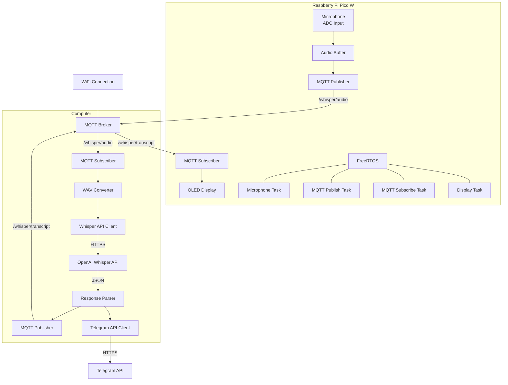

# Voice Transcription System with Raspberry Pi Pico W, MQTT, and Whisper API

This project implements a distributed voice transcription system using a Raspberry Pi Pico W microcontroller, an MQTT broker, and the OpenAI Whisper API. The system captures audio from a microphone on the Pico W, sends it to a computer for processing through Whisper API, and displays the transcription results.

## System Architecture



## Data Flow

1. **Audio Capture**: The Pico W microphone task samples audio at 8kHz using the ADC
2. **MQTT Publishing**: Raw audio data is published to the MQTT broker on topic `/whisper/audio`
3. **Computer Processing**: 
   - Computer subscribes to `/whisper/audio` topic and receives the data
   - Converts audio data to WAV format
   - Sends the WAV file to OpenAI Whisper API via HTTPS
   - Receives transcription from the API
   - Publishes transcription to `/whisper/transcript` topic
   - Sends both audio and transcription to Telegram
4. **Transcription Display**: The Pico W receives the transcription via MQTT and displays it on its OLED display

## Components

### Hardware
- **Raspberry Pi Pico W**: Main microcontroller with WiFi capabilities
- **ADC Input**: For audio capture from an analog microphone
- **OLED Display**: For showing transcription results

### Software
#### Pico W Side
- **FreeRTOS**: Real-time operating system managing multiple tasks
- **MQTT Client**: For communication with the broker
- **Audio Sampling**: ADC-based audio capture

#### Computer Side
- **MQTT Client**: For receiving audio and sending transcriptions
- **WAV Converter**: For formatting audio data properly
- **Whisper API Client**: For sending requests to OpenAI
- **Telegram API Client**: For sending messages with audio and transcriptions

### External Services
- **MQTT Broker**: Message broker handling the communication between Pico W and computer
- **OpenAI Whisper API**: Cloud service for speech-to-text transcription
- **Telegram API**: For sending notifications with audio and transcriptions

## MQTT Topics

| Topic | Publisher | Subscriber | Description |
|-------|-----------|------------|-------------|
| `/whisper/audio` | Pico W | Computer | Raw audio data from microphone |
| `/whisper/transcript` | Computer | Pico W | Transcription text from Whisper API |

## Requirements

- Raspberry Pi Pico W with OLED display
- Microphone (analog)
- Computer running MQTT broker and processing scripts
- WiFi connection
- OpenAI API key
- Telegram Bot Token (optional)

## Setup and Configuration

### Pico W Setup
1. Configure your WiFi credentials in the code
2. Set the MQTT broker address to point to your computer
3. Build and flash the project to your Pico W

### Computer Setup
1. Install required dependencies (MQTT client, Whisper API client)
2. Configure the OpenAI API key
3. Set up Telegram bot (optional)
4. Run the processing script

## Building and Running the Project

### Pico W Firmware
```bash
cd 24b-emb-projeto-dale
mkdir build
cd build
cmake ..
make
```

Flash the resulting `pico_emb.uf2` file to your Pico W.

### Computer-Side Processing Script
Navigate to the Python directory and run the processor script:

```bash
cd 24b-emb-projeto-dale/python
python3 whisper_processor.py
```

Make sure the MQTT broker (like Mosquitto) is running on your computer:

```bash
# If not already running
brew services start mosquitto  # for macOS
# or
mosquitto -v                  # to run in foreground with verbose output
```

## Project Structure

```
24b-emb-projeto-dale/
├── CMakeLists.txt            # Main CMake configuration
├── main/                     # Pico W firmware code
│   ├── CMakeLists.txt
│   ├── main.c               # Main application code
│   └── mqtt_client.c        # MQTT client implementation
├── freertos/                 # FreeRTOS configuration
├── python/                   # Computer-side processing scripts
│   ├── whisper_processor.py # Script for audio processing & Whisper API
│   └── telegram_bot.py      # Telegram bot integration
└── README.md                # This documentation
```

## Notes

- The system requires a stable WiFi connection for reliable communication
- Audio quality and transcription accuracy depend on the microphone quality and environmental noise
- Consider adjusting the audio sampling parameters for your specific microphone setup
